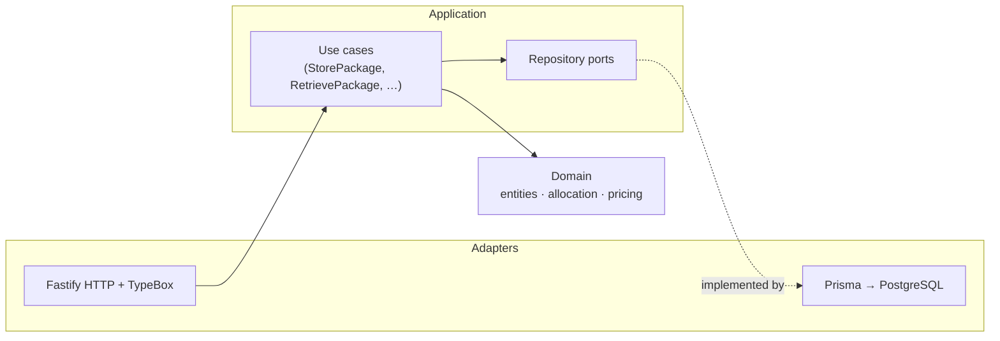
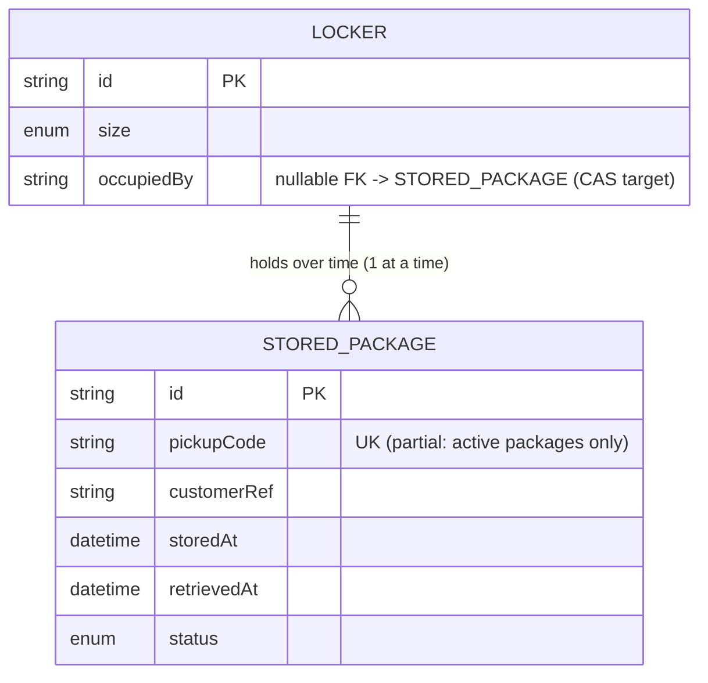

# Architecture Spine — Smart Package Locker Management System

## Design Paradigm

**Hexagonal (ports & adapters)** — one Fastify service in a pnpm/Turborepo monorepo, three inward-facing layers:

| Layer | Workspace / directory | Contains |
| --- | --- | --- |
| Domain | `packages/domain/src/` | `Locker`, `StoredPackage` entities; allocation rule, `StoragePricingPolicy`, pickup-code generation/validation — pure TypeScript, zero runtime deps |
| Application | `apps/api/src/application/` | Use cases (`StorePackage`, `RetrievePackage`, `CreateLocker`, `ListLockers`) + repository ports (`LockerRepository`, `PackageRepository`) |
| Adapters | `apps/api/src/adapters/http/`, `apps/api/src/adapters/db/` | Fastify routes + TypeBox schemas; Prisma repositories implementing the ports |

The PRD's "designed so it can be extended easily" requirement is this diagram: the domain never learns about Postgres or HTTP.



Dependency direction is strictly inward: `adapters → application → domain`. Nothing in `domain/` or `application/` imports `fastify`, `@prisma/*`, or `@sinclair/typebox`.

## Invariants & Rules

### AD-1 — Single REST API service, Fastify, contract-first schemas
- **Binds:** all
- **Prevents:** per-level interface drift (REST for Level 1, something else for Level 3)
- **Rule:** All Levels 1–4 capabilities are exposed as JSON-over-HTTP endpoints on one Fastify service. Every route declares its request/response shape as a TypeBox schema (single source of truth for validation + OpenAPI via `@fastify/swagger`, interactive docs at `/docs`). The Level-1 list contract is frozen verbatim: `200 {"lockers": [{"id": string, "size": "SMALL"|"MEDIUM"|"LARGE", "occupied": boolean}]}`, ordered by `id`; `occupied` is the only availability field; no per-locker package detail in v1. **[ADOPTED]** (interface = REST API: user decision)

### AD-2 — Inward-only dependency rule, enforced by workspace boundaries
- **Binds:** all
- **Prevents:** domain logic leaking into route handlers or Prisma models, making the domain untestable and the PRD's extensibility rule hollow
- **Rule:** The domain is its own workspace package (`@locker/domain`) with **zero runtime dependencies** — it physically cannot import Fastify, Prisma, or TypeBox. `apps/api` depends on `@locker/domain`, never the reverse. Within `apps/api`, `src/application/` imports nothing from `src/adapters/` except through port interfaces it defines. Enforced mechanically by ESLint `no-restricted-imports` zones (or dependency-cruiser) wired into `turbo lint` — violations fail the build, not just review.

### AD-3 — Allocation is one transaction: smallest-fitting locker, `FOR UPDATE SKIP LOCKED`
- **Binds:** LVL-1-storage, LVL-4-concurrency
- **Prevents:** two concurrent store requests receiving the same locker; deadlocks under load; oversize assignment (Large package into Small locker) and waste (Large package into Large when a Medium is free)
- **Rule:** Storing a package = one Prisma interactive transaction (`prisma.$transaction`) that (a) selects available lockers with `capacity >= package size` `ORDER BY size rank, id` `FOR UPDATE SKIP LOCKED` **via `$queryRaw`** — the fluent Prisma API cannot express row locking; substituting it silently weakens Level 4 — takes the first, (b) marks it occupied, (c) creates the package + pickup code — commit or roll back atomically. All transactions run at the Postgres default READ COMMITTED; raising isolation is forbidden in v1 — correctness comes from row locks and CAS updates only; a Prisma P2034 write conflict maps to `INTERNAL_ERROR` with a bounded (3×) retry in the repository. If no row is lockable, the store request fails with `NO_SUITABLE_LOCKER`. Size rank: `SMALL(1) < MEDIUM(2) < LARGE(3)`; a package's size is the *minimum* locker size that fits it.

### AD-4 — State transitions live only in application use cases
- **Binds:** all
- **Prevents:** two owners of locker/package state (routes mutating Prisma directly beside use cases doing the same)
- **Rule:** Only `src/application/` use cases may change locker occupancy or package lifecycle (`STORED → RETRIEVED`). HTTP handlers parse/validate/serialize and delegate; Prisma repositories are the sole code touching tables; retrieval marks locker free + package retrieved in one transaction. Every occupancy mutation is a compare-and-swap on the locker's `occupiedBy` column (guarded `UPDATE … WHERE id = ? AND occupiedBy = ?`) or a row lock (`FOR UPDATE`) — never a blind boolean write, so a concurrent store can't lose a free/occupy transition.

### AD-5 — Storage pricing is a pure domain policy, tiered by elapsed 24h days
- **Binds:** LVL-3-charges
- **Prevents:** pricing logic forked between retrieval endpoint and any future preview/audit path; off-by-one tier disputes
- **Rule:** `StoragePricingPolicy.charge(storedAt, retrievedAt)` — pure, integer result in **plain units** (1 = one unit, per the PRD's "X units/day"; no minor units, no floats, no currency conversion). Days = `ceil(elapsed / 24h)`; day 1 counts from storage time. Days 1–5 → X/day; days 6–10 → 2X/day; day 11+ → 3X/day; X = `STORAGE_FEE_BASE` env (default 10). Retrieval responses carry `storageCharge` + `daysCharged` breakdown. **[ADOPTED]** (partial day bills as a full day — user decision 2026-09-13).

### AD-6 — Pickup code contract
- **Binds:** LVL-2-retrieval
- **Prevents:** guessable/colliding codes; retrieval side effects on invalid attempts
- **Rule:** Pickup code = 8 chars, uppercase alphanumeric minus `0/O/1/I`, generated only on successful store, DB-unique across *unretrieved* packages, bound to exactly one (package, locker). Codes are never regenerated for reuse after retrieval. Retrieval resolves the package in exactly one query — `pickupCode = ? AND lockerId = ? AND status = 'STORED'`; no match → `INVALID_PICKUP_CODE`, zero state change, no code-burn (codes stay valid after a wrong attempt).

### AD-7 — One error envelope, stable codes
- **Binds:** all
- **Prevents:** each endpoint inventing its own error shape (PRD: "handle invalid scenarios properly")
- **Rule:** Every non-2xx response is `{"error": {"code": "<STABLE_UPPER_SNAKE>", "message": "<human text>"}}` — `NO_SUITABLE_LOCKER` (409), `INVALID_PICKUP_CODE` (404), `LOCKER_NOT_FOUND` (404), `LOCKER_EMPTY` (409, valid locker but already retrieved), `VALIDATION_ERROR` (400), `INTERNAL_ERROR` (500). The `error.code` list is the API contract; codes are never renamed.

### AD-8 — PostgreSQL is the only state; schema moves only via `prisma migrate`
- **Binds:** all
- **Prevents:** hidden in-process state that breaks multi-instance correctness (Level 4) and undocumented schema drift
- **Rule:** All durable state lives in Postgres (Prisma). No module-level mutable stores. One package per locker is enforced in the schema (partial unique index on the occupied-by column), not just in code. Schema changes ship as migration files committed with the story that needs them; production applies them via `prisma migrate deploy` in the container entrypoint (the deploy platform — Render — provisions the Postgres and injects `DATABASE_URL`; the app never boots against an unmigrated schema). **[ADOPTED]** (Postgres: user decision)

### AD-9 — One locker identifier: the cuid `lockerId`
- **Binds:** LVL-1-storage, LVL-2-retrieval
- **Prevents:** Epic A exposing a human display code ("A12") while Epic B validates retrieval against the cuid — customers holding one can never use the other
- **Rule:** A locker has exactly one identifier: its cuid. Every payload — `POST /lockers` response, `GET /lockers` items, `POST /packages` response, `POST /pickups` request — carries it as the field named `lockerId`. No secondary display code exists in v1.

### AD-10 — Frontend is a view over the API; the component library is presentation-only
- **Binds:** web UI, component library
- **Prevents:** the SPA forking the domain rules (its own allocation/pricing math) or the library accumulating fetch/business logic, creating a second owner of truth beside the API
- **Rule:** `apps/web` holds all routing, data fetching, and API error-envelope handling; it computes **no** domain outcomes — every displayed charge/assignment comes from an API response. `packages/ui` (`@locker/ui`) exports only presentational React components (shadcn/Tailwind, product theme tokens); it imports no API client and holds no business logic. Web's API types are generated from the API's OpenAPI schema, never hand-copied. The API (AD-1–AD-9) remains the sole state authority.

## Consistency Conventions

| Concern | Convention |
| --- | --- |
| Naming | TS files `kebab-case`, types/classes `PascalCase`, functions/vars `camelCase`; DB tables/models singular `PascalCase` Prisma models (`Locker`, `StoredPackage`), snake_case columns |
| Data & formats | IDs: cuid strings; enums: `SMALL`/`MEDIUM`/`LARGE`, `STORED`/`RETRIEVED`; timestamps ISO-8601 UTC (`storedAt`, `retrievedAt`); money as plain integer units, never floats (`storageCharge`, `STORAGE_FEE_BASE`) |
| State & cross-cutting | Errors per AD-7 envelope; config from env (`DATABASE_URL`, `PORT`, `STORAGE_FEE_BASE`) validated once at boot; request logging via Fastify's built-in logger (JSON); no auth in v1 (PRD scope-out) |
| Endpoints | `POST /lockers`, `GET /lockers`, `POST /packages` (store → returns `lockerId` + `pickupCode`), `POST /pickups` (retrieve), `GET /health`, `GET /docs` (OpenAPI). Resource-plural, verbs in POST bodies |

## Stack

| Name | Version |
| --- | --- |
| TypeScript | 7.0.2 |
| Node.js | 24 LTS (runtime; Docker base `node:24-alpine`; Active LTS — 22 is maintenance-only) |
| Fastify | 5.12.4 |
| typebox | 1.3.30 (with `@fastify/type-provider-type-box` 6.1.0) |
| @fastify/swagger | 9.8.1 |
| @fastify/swagger-ui | 6.1.1 (serves `/docs`; swagger alone is JSON-only) |
| Prisma | 7.10.0 (8.x is RC-only — do not upgrade casually; v7 API is `prisma.$transaction` + `tx.$queryRaw`) |
| PostgreSQL | 18 (image `postgres:18-alpine`) |
| Vitest | 5.0.0 |
| Turborepo | 2.10.12 |
| pnpm (workspaces) | 12.4.1 |
| React | 19.3.0 (apps/web SPA) |
| Vite | 8.3.0 |
| Tailwind CSS | 4.3.3 |
| shadcn CLI | 4.21.0 (components live in `packages/ui`) |

## Structural Seed

```text
smart-package-everest/            # pnpm workspace + Turborepo
  turbo.json                      # pipelines: build, test, lint, dev, db:migrate
  pnpm-workspace.yaml             # apps/*, packages/*
  apps/
    api/                          # Fastify service
      src/
        application/              # use cases + repository ports
        adapters/
          http/                   # app factory, routes, TypeBox schemas, error mapper
          db/                     # PrismaClient, repositories implementing ports
        config/                   # env parsing (single boot-time validation)
      prisma/                     # schema.prisma + migrations/
      test/                       # Vitest suites (per-level), test-db helpers
      Dockerfile                  # multi-stage via `turbo prune`, target: Render
    web/                          # React SPA (Vite): role screens, API client,
                                  #   nginx Dockerfile -> Render static deploy
  packages/
    domain/                       # @locker/domain — entities, allocation rule,
                                  #   StoragePricingPolicy, pickup codes; zero deps
    ui/                           # @locker/ui — shadcn/Tailwind component library,
                                  #   presentation-only (no fetching, no business logic)
  docker-compose.yml              # local dev/test: postgres:18-alpine + api
```

Core entities (names + relationships; attributes that are invariants live in ADs, not here):



## Capability → Architecture Map

| Capability / Area | Lives in | Governed by |
| --- | --- | --- |
| LVL-1-storage (create lockers, list availability, store with smallest-fit allocation) | `CreateLocker`, `ListLockers`, `StorePackage` use cases; `POST /lockers`, `GET /lockers`, `POST /packages` | AD-1, AD-3, AD-4, AD-7 |
| LVL-2-retrieval (validate locker id + code, free locker) | `RetrievePackage` use case; `POST /pickups` | AD-4, AD-6, AD-7 |
| LVL-3-charges (record storedAt, tiered pricing on retrieval) | `StoragePricingPolicy` (domain) + `RetrievePackage` | AD-5 |
| LVL-4-concurrency (parallel stores, no double-assignment) | `StorePackage` transaction + Prisma repo | AD-3, AD-8 |
| Web UI (agent console, customer retrieval) | `apps/web` (Vite SPA) + generated OpenAPI client | AD-10, AD-1, AD-7 |
| Component library (shadcn/Tailwind, product theme) | `packages/ui` (`@locker/ui`) | AD-10 |
| Operational envelope (run locally, deploy) | Turborepo pipelines + `apps/api/Dockerfile` (turbo prune) → Render; `apps/web` nginx static → Render; docker-compose for dev/test | AD-8, Stack table |

## Deferred

- **Multi-station topology** — PRD assumes one station; schema keeps a future `stationId` easy to add without pre-building it.
- **Customer as a first-class entity** — retrieval is anonymous via code; `customerRef` string on the package suffices until notifications exist.
- **Pickup-code hashing at rest** — plaintext is acceptable for the challenge; hashing is a one-repo change later.
- **Notification of codes (SMS/email), auth for agents/customers** — PRD out of scope.
- **CI pipeline, observability/metrics** — Railway deploy doesn't need them for the challenge; add when the project outgrows it.
- **Per-story test-DB strategy detail** (truncate vs transaction-rollback) — owned by the build stories; spine fixes only "Vitest against the compose Postgres, isolated per suite".
